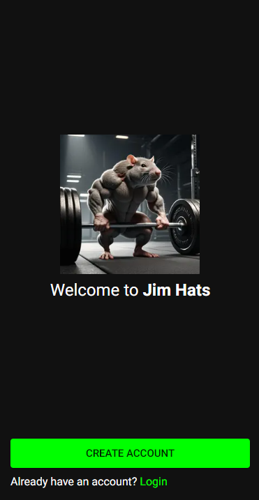
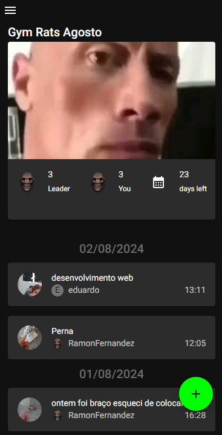
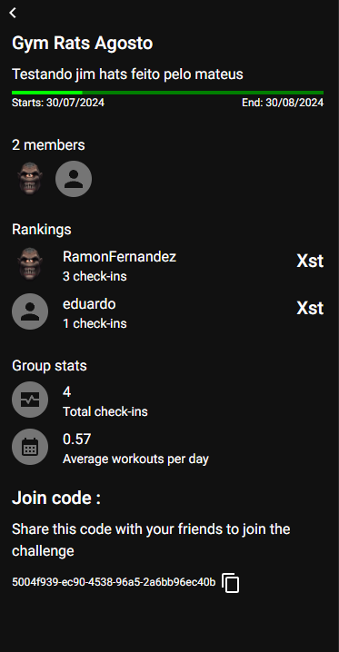
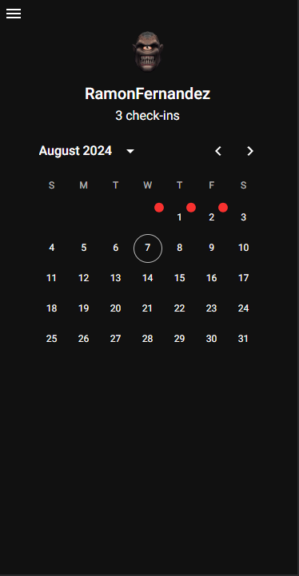

<!-- Improved compatibility of back to top link: See: https://github.com/othneildrew/Best-README-Template/pull/73 -->

<!--
*** Thanks for checking out the Best-README-Template. If you have a suggestion
*** that would make this better, please fork the repo and create a pull request
*** or simply open an issue with the tag "enhancement".
*** Don't forget to give the project a star!
*** Thanks again! Now go create something AMAZING! :D
-->

<!-- PROJECT SHIELDS -->
<!--
*** I'm using markdown "reference style" links for readability.
*** Reference links are enclosed in brackets [ ] instead of parentheses ( ).
*** See the bottom of this document for the declaration of the reference variables
*** for contributors-url, forks-url, etc. This is an optional, concise syntax you may use.
*** https://www.markdownguide.org/basic-syntax/#reference-style-links
-->

<!-- PROJECT LOGO -->
 

  

  <h3 align="center">Jim Hats</h3>

  

    App to compete with your friends in a Gym Group
     
   
    
  

<!-- TABLE OF CONTENTS -->

<!-- ABOUT THE PROJECT -->

## About The Project

Jim Hats is a web application that allows you to compete with your friends in a Gym Group. You can create a group, invite your friends, and compete with them in different challenges. You can also track your progress and see how you are doing compared to your friends. The original app is called GymRats and can be found [here](https://www.gymrats.app/).

    

### Built With

<!-- * [![JQuery][JQuery.com]][JQuery-url]-->

- [Node.js](https://nodejs.org/en/)
- [TypeScript](https://www.typescriptlang.org/)
- [Next.js](https://nextjs.org/)
- [PostgreSQL](https://www.postgresql.org/)
- [Docker](https://www.docker.com/)
- [Express Js](https://expressjs.com/)
<!-- GETTING STARTED -->

## Getting Started

Soon...

## Screenshots

    

    

    

## License

Distributed under the MIT License. See `LICENSE` for more information.

<!--

(<a href="#readme-top">back to top</a>)

-->
