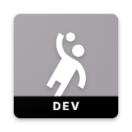

## Flavors

O aplicativo móvel Jim Hats contém flutter flavors especiais para 3 ambientes diferentes:

- `development` (desenvolvimento)
- `staging` (ambiente de preparação)
- `production` (Ambiente de produção)

Para cada flavor, o aplicativo possui diferentes propriedades. Por exemplo, o nome do aplicativo (label) e seu ícone variam conforme a flavor, por exemplo:

**development:**
<div align="center">
    
    <h3 align="center">[DEV] Jim Hats</h3>
</div>

**staging:**
<div align="center">
    
    <h3 align="center">[STG] Jim Hats</h3>
</div>

**production:**
<div align="center">
    
    <h3 align="center">Jim Hats</h3>
</div>

Ao executar cada flavor, as variáveis de ambiente devem ser populadas nos arquivos de ambiente respectivos a sua flavor, como .env.nome_flavor e devem ser referenciados como parâmetros de execução. Por exemplo:

Para executar o projeto em modo debug 
```sh
flutter run --debug --flavor development --dart-define-from-file=./.env.development
```

Para compilar e criar o APK de staging 
```sh
flutter build apk --release --flavor staging --dart-define-from-file=./.env.staging
```

<hr>

[Página anterior](../testes/index.md)

[Voltar ao início](../index.md)