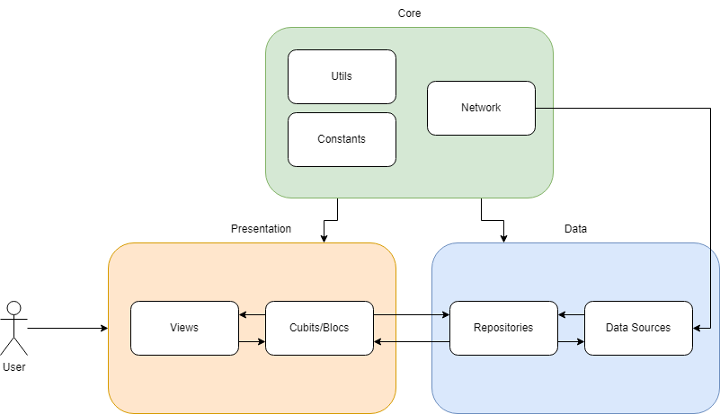

# Jim Hats 

## 📖 Visão Geral
Jim hats é um aplicativo para rastrear a frequência do usuário na academia ou em qualquer outro esporte que ele pratique. O foco principal é estimular o usuário a manter uma rotina de treinos em desafios criados por ele ou por amigos.
Baseado no existente aplicativo [Gym Rats](https://apps.apple.com/us/app/gym-rats/id1530730131), o Jim hats tem como objetivo ser uma alternativa mais simples e com menos funcionalidades se comparado ao Gym Rats.

## 🚀 Funcionalidades

### Autenticação
- Cadastro de usuário
- Login de usuário 

### Perfil
- Visualização de perfil
- Modificação de perfil

### Desafios
- Criação de desafios
- Modificação de desafios
- Exclusão de desafios
- Entrar em desafios
- Visualizar desafios
- Visualizar participantes de um desafio
- Visualizar Ranking de um desafio
- Visualizar desafios em que o usuário está participando

### Exercícios
- Adição de exercícios em um desafio específico com uma foto
- Modificação de exercícios
- Exclusão de exercícios
- Visualização de exercícios do desafio incluindo os exercícios feitos pelo usuário e os outros participantes

### Estatísticas
- Contagem de exercícios feitos pelo usuário
- Visualização em formato de calendário dos dias em que o usuário fez exercícios e quantos fez em certo dia ao longo do tempo

### Funcionalidades Adicionais
- Alternar entre temas claro e escuro


## 🛠️ Tecnologias Utilizadas

- **Linguagem**: [Dart](https://dart.dev/)
- **Framework**: [Flutter](https://flutter.dev/)
- **Gerenciamento de estado**: `Bloc`
- **Gerenciamento de dependências**: `pub.dev`
- **API e comunicação**: `Dio`
- **Injeção de dependências**: `GetIt`
- **Armazenamento local**: `Shared Preferences`
- **Integração com a câmera e galeria**: `Image Picker`, `Camera android`
- **Estilização**: `Material Design`
- **Informações de conectividade do dispositivo**: `Connectivity Plus`

## 🏗️ Arquitetura do Projeto

Este projeto segue uma arquitetura baseada em camadas, com o objetivo de separar responsabilidades e facilitar a manutenção e evolução do código.
Foram implementadas 2 Camadas principais: `Data` e `Presentation`. A camada `Core` contém configurações globais e utilitários.
Dentro da camada `Presentation`, existem 2 subcamadas: `Bloc/Cubit` e `View`.
Dentro da camada `Data`, existem 2 subcamadas: `Data Sources`, `Repositories`.

### 🏛️ Camadas da Arquitetura

A estrutura do projeto é dividida em 2 camadas principais e uma camada auxiliar:

```
📂 lib/
 ├── 📂 core/                 # Configurações globais, utilitários.
 ├── 📂 data/                 # Fonte de dados, DTOs, modelos e repositórios
 ├── 📂 presentation/         # Camada de apresentação (widgets, blocs,cubits, telas)
 ├── main.dart                # Arquivo principal
```

### 🔹 1. Core 
A camada `core/` contém configurações globais, como:
- **Constantes**: Constantes globais usadas em todo o aplicativo por exemplo, espaçamentos, variáveis de ambiente, etc.
- **Exceções**: Exceções personalizadas para tratamento de erros
- **Utils**: Funções utilitárias e extensões de tipos de dados
- **Network**: Configurações do cliente HTTP, interceptores, etc.
### 🔹 2. Data
A camada `data/` é responsável pelo acesso a dados e integrações externas, contendo:
- **Data Sources**: Classes para acessar dados de APIs. Recebem um cliente Http por injeção de dependência.
- **Modelos e DTOs**: Definição das estruturas de dados usadas internamente e para comunicação com APIs
- **Repositórios**: Recebem dados de fontes de dados e são responsáveis por seu cache e transformação.

### 🔹 3. Presentation
A camada `presentation/` gerencia a interface do usuário e interações, incluindo:
- **Gerenciamento de Estado**: gerenciamento do estado das telas com `Bloc` e `Cubit`. Consome dados dos repositórios e os transforma em estados. Além disso, gerencia eventos de interação do usuário, e realizam validações e chamadas a métodos de repositórios.
- **Controllers**: Lógicas simples de controle de tela por exemplo, mostrar ou esconder um widget.
- **Roteamento**: Configuração de rotas e navegação entre telas
- **Tema**: Configuração de temas e estilos globais do aplicativo
- **Widgets**: Componentes reutilizáveis entre telas no aplicativo
- **Views**: Telas do aplicativo, que consomem estados e exibem widgets

### 🔹4. Fluxo de interação entre as camadas

<p align="center">
  
</p>

